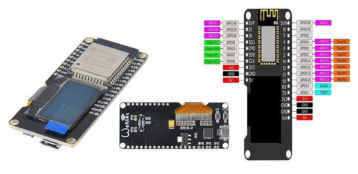
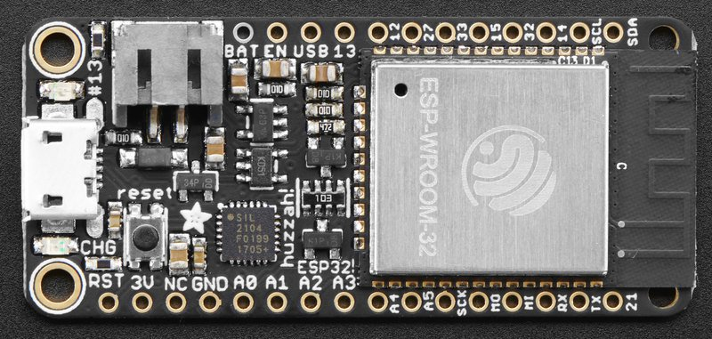
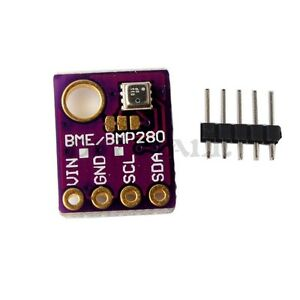

# ESP32BME280Example5_ReadAllRegistersPIO
# Reads all registers from two BME280s and outputs data to serial

### Need help or have a question? Good luck, I am clueless too.

## Contents
- [Development Status](#development-status)
- [Installation Instructions](#installation-instructions)
- [Decoding Exceptions](#decoding-exceptions)
- [Issue/Bug report template](#issuebug-report-template)
- [WEMOS LOLIN32 with OLED Board PINMAP](#board-name-WEMOS-LOLIN32)
- [AdaFruit Feather32 PINMAP](#-AdaFruit-Feather32)
- [BME280 PINMAP](#BME280)

## Development Status

Working at this whole thing.

## Installation Instructions
- Use VS Code and PlatformIO

#### Decoding exceptions

I have no idea how to do this or what they are talking about.

#### Issue/Bug report template
Before reporting an issue, make sure you've searched for similar one that was already created. Also make sure to go through all the issues labelled as look here.

Finally, if you're sure no one else had the issue, it's probably you.

## WEMOS LOLIN32
board name WEMOS LOLIN32
Must hols down button to program.

This ESP32 board requires the SSD1306 libraries to communicate with the OLED display.
On this board the I2C communication pins to the OLED display are pin5 (SDA) and pin4 (SCL), so make sure to change the pins in the initialization: SSD1306 display(0x3c, 5, 4)

## AdaFruit Feather32
Adafruit HUZZAH32 – ESP32 Feather Board
Don't need to hold anything low on the Feather.
    I2C Connections:
        SCL 22
        SDA 23

## BME280
I2C address is 0x76 or 0x77 if you cut the trace between the left two pads and add a jumper to the right two pads.

## Hint

Sometimes to program ESP32 via serial you must keep GPIO0 LOW during the programming process.