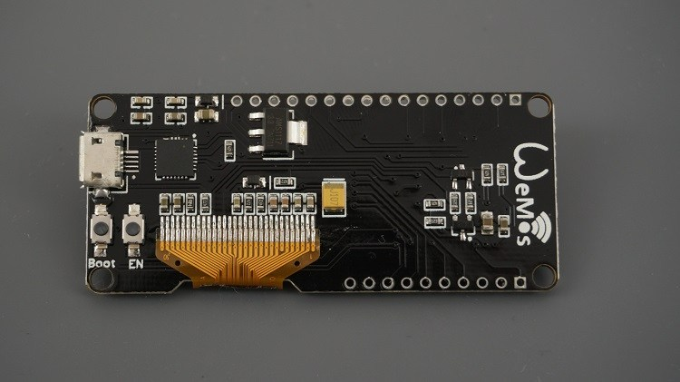

# ESP32BME280Example5_ReadAllRegistersPIO
# Reads all registers from two BME280s and outputs data to serial

### Need help or have a question? Good luck, I am clueless too.

## Contents
- [Development Status](#development-status)
- [Installation Instructions](#installation-instructions)
- [Decoding Exceptions](#decoding-exceptions)
- [Issue/Bug report template](#issuebug-report-template)
- [WEMOS LOLIN32 with OLED Board](#WEMOS-LOLIN32)
- [AdaFruit Feather32](#-AdaFruit-Feather32)
- [Heltec WiFi LORA 32 V1](#Heltec-WiFi-LORA-32-V1)
- [BME280](#BME280)

## Development Status

Working at this whole thing.

## Installation Instructions
- Use VS Code and PlatformIO

#### Decoding exceptions

I have no idea how to do this or what they are talking about.

#### Issue/Bug report template

Finally, if you're sure no one else had the issue, it's probably you.

## WEMOS LOLIN32
Board name WEMOS LOLIN32. 
Must hold down button near edge to begin program.

This ESP32 board requires the SSD1306 libraries to communicate with the OLED display. 
On this board the I2C communication pins to the OLED display are pin5 (SDA) and pin4 (SCL), so make sure to change the pins in the initialization: SSD1306 display(0x3c, 5, 4)

## AdaFruit Feather32
Adafruit HUZZAH32 – ESP32 Feather Board 
Don't need to hold anything low on the Feather. 
<ul>
    <li>I2C Connections:</li>
    <li>    SCL 22</li>
    <li>    SDA 23</li>
</ul>

## Heltec WiFi LORA 32 V1
Heltec WiFi LORA 32 V1 – ESP32 with OLED and LORA Board 
To program you need to hold button labeled PRG near coil antenna. 
<ul>
    <li>I2C Connections:</li>
    <li>    SCL 22</li>
    <li>    SDA 21</li>
</ul>

## BME280
I2C address is 0x76 or 0x77 if you cut the trace between the left two pads and add a jumper to the right two pads.

## Hint

Sometimes to program ESP32 via serial you must keep GPIO0 LOW during the programming process.